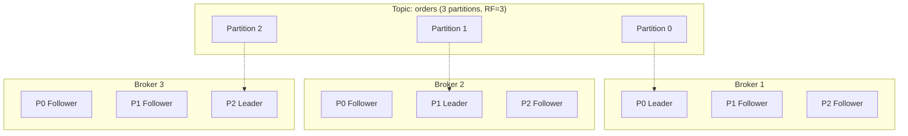
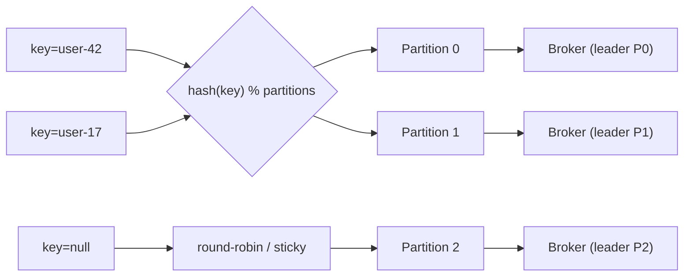
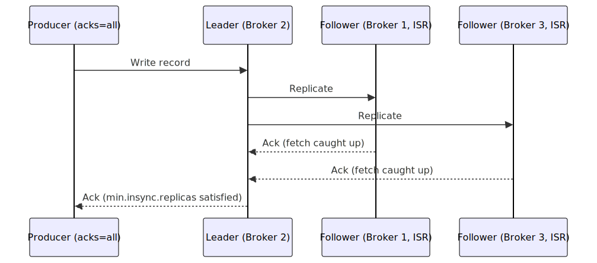
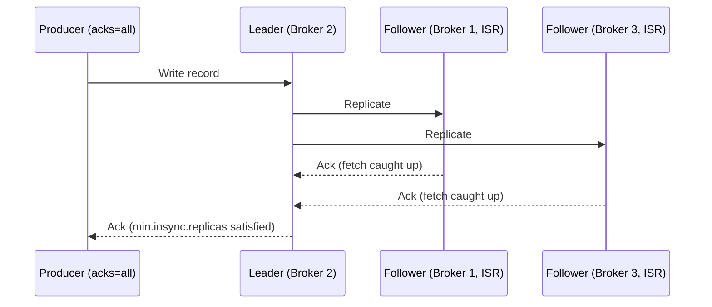
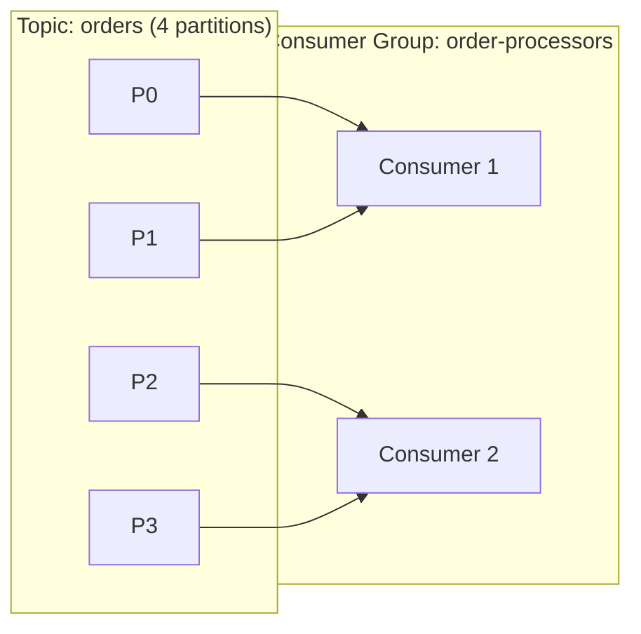
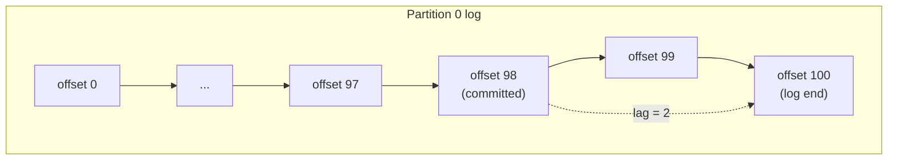

# Kafka Core Concepts — Diagrams

> Visual reference for topic/partition/replica architecture referenced across Module 1-3 guides.
> SVG shown below each diagram (works everywhere, width-capped). Mermaid source collapsed underneath — expand to edit / view in renderers with native Mermaid support (GitHub, VS Code).
> SVGs regenerated via `scripts/render-diagrams.py` (uses [mermaid.ink](https://mermaid.ink)).

---

## 1. Topic → Partitions → Broker Replication

A topic is split into partitions; each partition is replicated across N brokers (`replication.factor`). One replica is **leader** (serves all reads/writes), others are **followers** (ISR members).

Mermaid source

---

## 2. Producer Partitioning (key → partition)

Producer hashes message key to pick a partition (or round-robins if key is null). All messages with same key land on same partition → preserves order per key.

Mermaid source

---

## 3. In-Sync Replica (ISR) Set & Acks

`acks=all` waits for all ISR members to ack before confirming write. `min.insync.replicas` sets minimum ISR size for write to succeed.

Mermaid source

---

## 4. Consumer Group Partition Assignment

Each partition assigned to exactly one consumer within a group. More consumers than partitions → idle consumers. Fewer → some consumers own multiple partitions.

Mermaid source

---

## 5. Consumer Lag

Lag = latest offset (log end) − consumer's committed offset. Growing lag → consumer slower than producer.

Mermaid source

---

## Related guides

- [Module 1: Configure Topics for High Availability](module-1-guide.md) — replication factor, partitions
- [Module 2: Monitor Performance and Identify Bottlenecks](module-2-guide.md) — consumer lag, group sizing
- [Module 3: Optimize Producer and Consumer Performance](module-3-guide.md) — batching, ISR/acks tuning
  </content>
